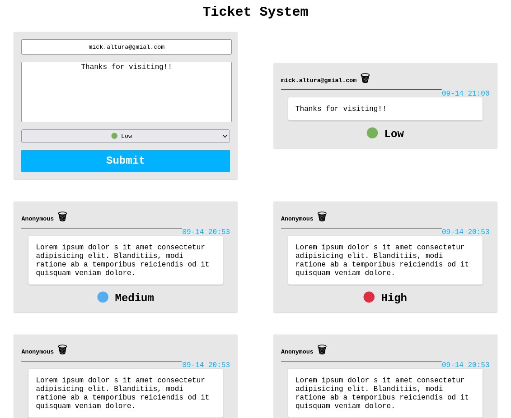

# ticketSystem Vue/Express.js 🧰

## About 📚

A vuejs/expressjs based ticket system.

## Preview 🔍

## Installation 🔧

### Install Dependencies 📦 FrontEnd

    cd client
    npm init
    snowpack dev || other webpack or dev server

### Install Dependencies 📦 BackEnd

    cd server
    npm install || yarn install
    node server.js || nodemon server.js

## Builded With 🧰

1. MongoDB - NoSQL database
2. Express - RESTful API
3. Vue JS - Just the CDN DEV
4. NodeJS - Server

- ReactJs / SASS / ReactHooks
- mongoose / uuid / body-parser

## Features

1. Api Consumtion
2. Search By Input or By Category
3. Save To Server
